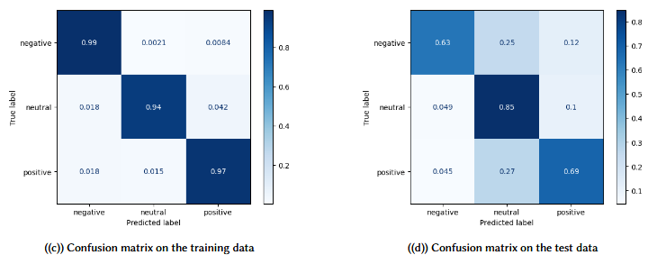

# Sentiment Analysis on Financial Phrase Bank v.1.0

_Coursework for Natural Language Processing course at Technische Universität Berlin (M.Sc. Computer Engineering)_

## Overview 

In this project we implemented and trained different model architectures to perform sentiment analysis on financial news using  `scikit-learn` and `PyTorch`. Additionally, we used `Weights & Biases` sweeps to perform hyperparamter tuning and investigate the impact of different text pre-processing and text vectorization approaches. 

## Dataset 

The Project uses the Financial Phrase Bank dataset from
_Malo, P., Sinha, A., Korhonen, P., Wallenius, J., & Takala, P. (2014). Good debt or bad debt: Detecting semantic orientations in economic texts. Journal of the Association for Information Science and Technology, 65(4), 782-796._

It contains about 5,000 labeled sentences from the finance and economics news domain. Each sentence in the dataset was labeled by 16 domain experts as having either positive, negative, or neutral sentiment, reagarding its implications for potential investors and stock market values. In this project we used the examples where at
least 50% of the annotators agreed on the label ([`FinancialPhraseBank-v1.0/Sentences_50Agree.txt`](FinancialPhraseBank-v1.0/Sentences_50Agree.txt)).

## Implemented models 

- **Naive Bayes classifier**
- **Fully-connected neural network**
- **Recurrent neural network**

## Experiments

We used `Weights & Biases` sweeps to evaluate the performance of our models w.r.t. some combinations of different pre-processing steps and hyperparameters (for the network models):

#### Different (combinations of) text pre-processing steps:
- remove punctuation
- remove stopwords
- remove numbers
- lemmatization

#### Different text vectorization methods:
- Bag of Words
- TF-IDF
- GloVe pre-trained embeddings
- BERT-based embeddings

#### Hyperparameters:
- learning rate
- L1 regularization
- L2 regularization
- number of training epochs
- training batch size
- hidden layer dimension 

## Results

These are the results for the best performing model for each architecture.

The standard neural network performs best on the test set (highest F1-score) but is strongly overfitting (hard to avoid due to the small dataset).

### 1. Naive Bayes Classifier


#### Confusion matrices


### 2. Fully-connected Neural Network


#### Confusion matrices



### 3. Recurrent Neural Network


## Usage

#### 1. Install the requirements:
```bash
pip install -r requirements.txt
```

#### 2. Run experiment using Weights & Biases sweep:
##### 2.1 Log into `Weights & Biases`
```bash
wandb login
```
##### 2.2 Initialize sweep (example)
```bash
wandb sweep sweep_configs/nn_sweep_preprocessing.yaml
```
##### 2.3 Run the sweep

```bash
wandb agent <your-entity>/<project-name>/<sweep-ID>
```


